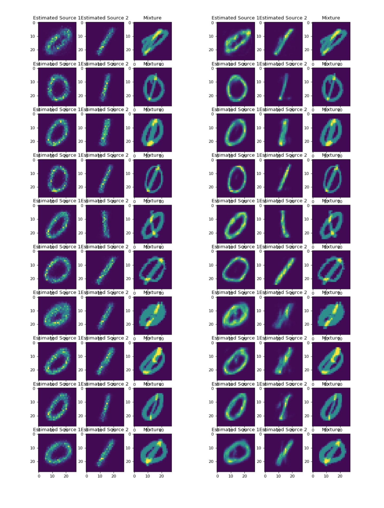

# Simple MNIST experiments:

* Here's the ML vs GAN source separation figure: 

## Things to try to get rid of the jitter effect: 
* Try using fewer dimensional inputs, to get rid of the jitter noise effect. 
* Try convolutive networks. 
* Try autoencoder style. 

* Try audio.
* Debug the version where the input is the mixture.  

# update: (09 September 2017) 
* I have added a convolution layer at the end of 1 hidden layer perceptron. The generator network is like this: 
\begin{align}
h^1 =& \tanh( W^1 x), \\
h^2 =& \text{SoftPlus} (W^2 h^1), \\
y = & \text{SoftPlus} (W^3 * h_2),
\end{align}
where I used 500 dimensional random noise for the input. $h^1, h^2$ are respectively 200 and 784 dimensional. At the last layer the convolution mask is 5x5. 

* The discriminator network is this: 
\begin{align}
h^1 =& \tanh( W^1 x), \\
y =& \text{Sigmoid}((w^2)^\top h^1),
\end{align}
where the output is a scalar between 0 and 1. 
* The results look like the following now: (In both cases I am mapping 500 dimensional random noise to the images) I am first showing  **Adversarial** then  **Maximum Likelihood**. It seems like using a convolutive output layer alleviates the noise problem in the digit textures. And, it still seems like GAN separation results are cleaner in terms of interference/artifacts. 

## Things to try next: 
* Try variational autoencoders
* Start working on an audio dataset 
